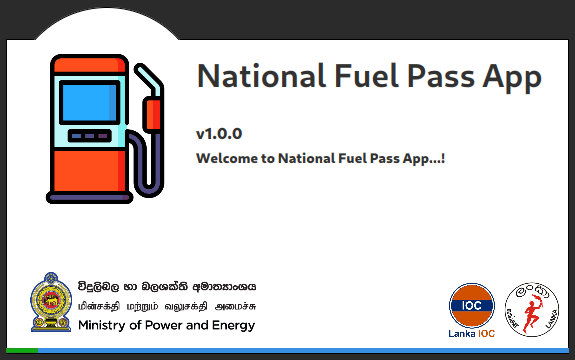
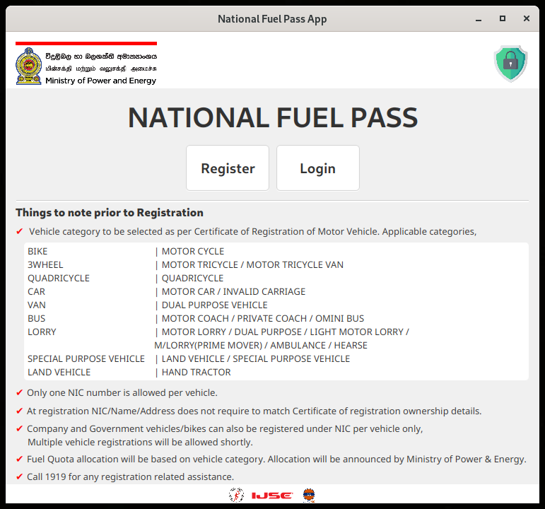
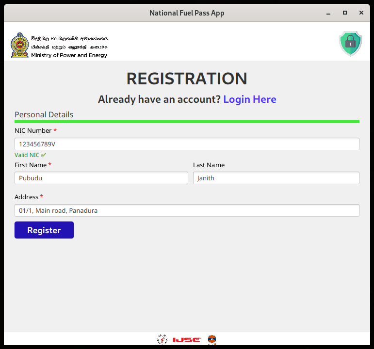
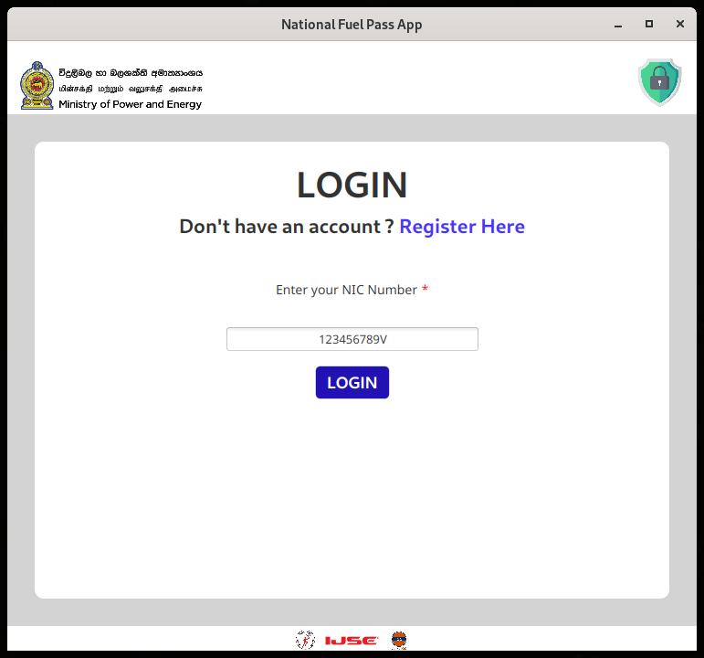
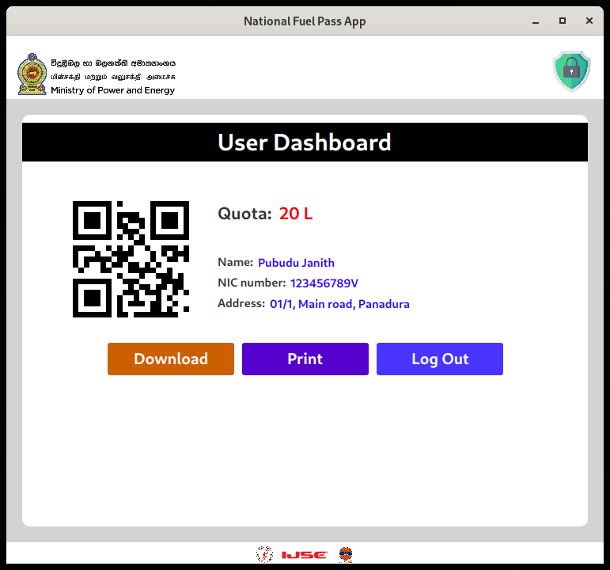
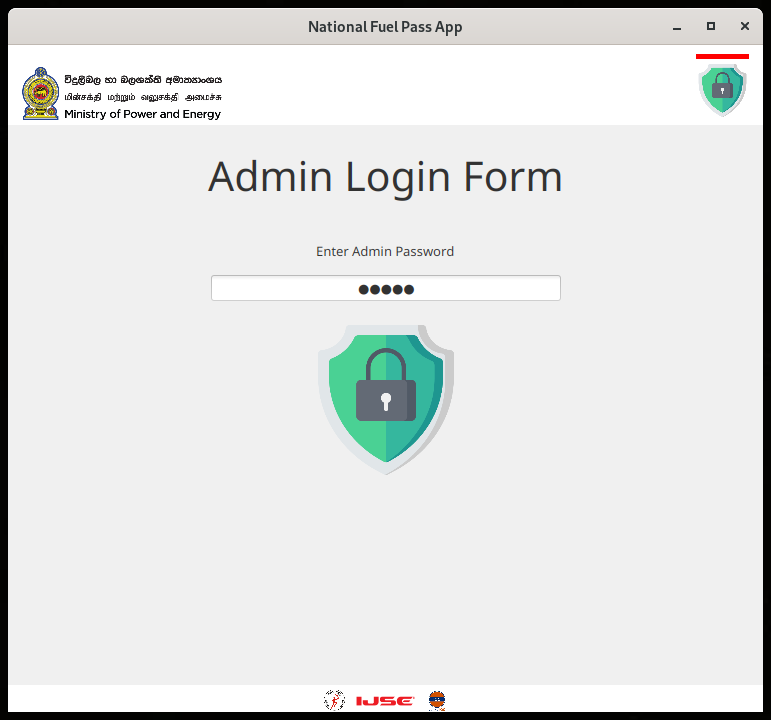
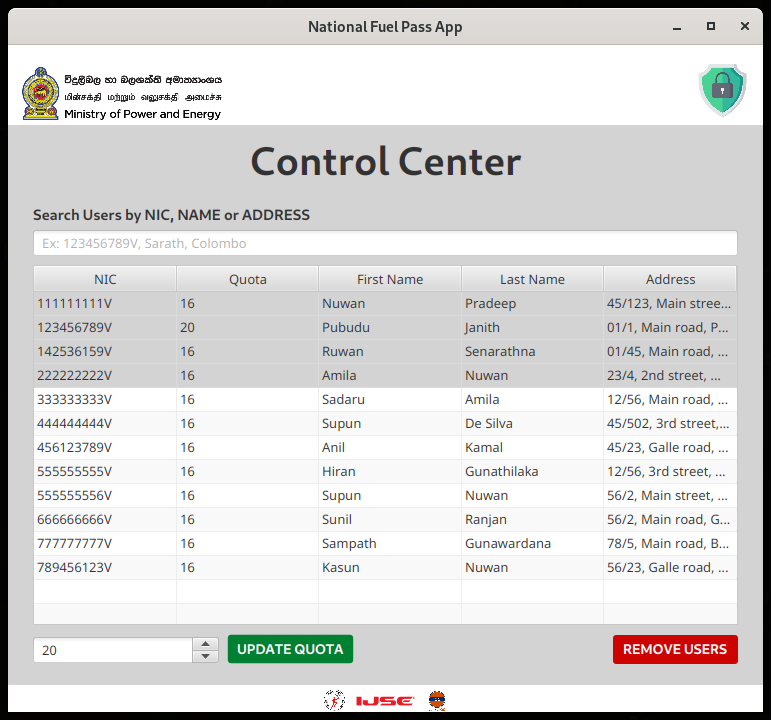

# Fuel Pass App Clone 

A Java FX application clone of the [fuelpass.gov.lk](https://fuelpass.gov.lk/)

The Information and Communication Technology Agency (ICTA) and the Ministry of Power and Energy together created the national 
fuel pass app to provide Sri Lanka with the best possible response to the country's fuel shortages in mid-2022.

This clone application was created exclusively for educational purposes, 
in order to understand and improve the software development skills.
Some design layout and images of the application are copyright to their respective owners.

**The main features of the application as follows,**
 * Users can register to the app by NIC number, name and address.
 * Users will get available fuel quota with QR code, Once logged into user dashboard.
 * The administrator can perform search, update and delete operations for the registered users in the database.

The goal of this project was to understand and improve the knowledge of Java-FX, 
JDBC, Java and CRUD operations in MySQL.

#### Images of the user interfaces
1. Splash screen 
   

2. Welcome-form 
   The user-login and registration forms are linked via the welcome form's navigation buttons.
   Using the padlock icon in the upper right corner, admin can access the admin login form.
   By clicking the logo in the upper left corner of the welcome form, a user or an admin can always be sent back to the welcome form.  
   

3. Registration-form 
   All users are registered to the database from the registration form.
   All submitted data are validated here.
   When registering to the database, users are required to provide their NIC number, first name, and address (last name is optional).
   Once registered successfully,
   User will be taken to the login form.  
   

4. Login-form 
   Once a user has registered in the database.
   He or she can access the user dashboard form by entering their 
   registered NIC number in the login form.  
   

5. User dashboard-form 
   The user dashboard form shows the available fuel quota for the user along with the QR code and user details. 
   Users have the option to download or print this QR code.  
   

6. Admin login-form 
   Admin can login to the Control Center form using the admin login form. 
   Only one administrator can be present in the system.  
   

7. Control center-form 
   The Control Center has all the details of the registered users and the 
   admin can search users by NIC, user name or address. Also, the admin can 
   update the fuel quota of the users and delete the users 
   from the database.  
    

## Used Technologies

- Java SE 11
- MySQL Community Server 8.0.31
- Apache Maven 3.8.6
- Added dependencies to pom.xml
    - javafx-fxml 18.0.1
    - javafx-web 18.0.1
    - javafx-swing 18.0.1
    - ZXing Core 3.5.0
    - mysql-connector-java 8.0.30

#### Used Integrated Development Environment
- IntelliJ IDEA

## How to use ?
This project can be used by cloning the
project to your local computer. 

Make sure to create a "fuel_app_db" database in the MySQL community server 
and add the table from the database-script.sql file to it. 

To establish a singleton connection with the MySQL server, change the DBConnection class mySQL user name and password.

#### Clone the repository
1. Clone the project using `git clone https://github.com/PubuduJ/fuel-pass-app-clone.git` terminal command.
2. Open the `pom.xml` file from **IntelliJ IDEA**, make sure to open this as a project.
3. To run this application execute `mvn javafx:run` goal or create separate maven configuration in **IntelliJ IDEA**.

## Credits
This project was carried out under the guidance of the [IJSE](https://www.ijse.lk/) Direct Entry Program 9.

## Version
v1.0.0

## License
Copyright &copy; 2022 [Pubudu Janith](https://www.linkedin.com/in/pubudujanith94/). All Rights Reserved. 
This project is licensed under the [MIT license](LICENSE.txt).